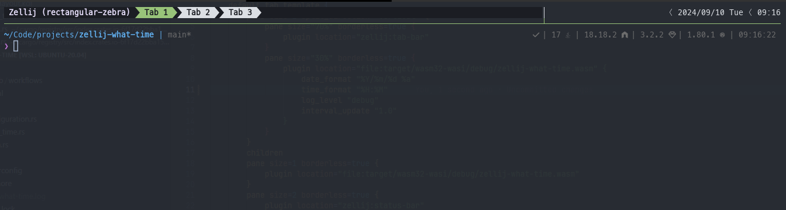

# 🕔 zellij-what-time

[](https://github.com/pirafrank/zellij-what-time/actions/workflows/ci.yml)
[](https://github.com/pirafrank/zellij-what-time/actions/workflows/release.yml)

zellij-what-time is a Zellij plugin to show the host system date and/or time in the status bar. Zero-config, but customizable. Inspired by zellij-datetime.



(zellij-what-time is in the top right corner)

## Why?

One of my setups is Mosh + Zellij + Blink Shell on my iPad. When Blink Shell is in full screen the iOS status bar with the time is not visible.

This plugin is designed to show the current time in the status bar of Zellij.

## Requirements

- Zellij 0.38.0 or later
- `date` (very unlikely you don't have it)

## Install

Download `zellij-what-time.wasm` from the [latest release](https://github.com/pirafrank/zellij-what-time/releases/latest) and place it to your Zellij plugins directory.

If you're using the default directory, just run:

```sh
mkdir -p ~/.config/zellij/plugins/
curl -L "https://github.com/pirafrank/zellij-what-time/releases/latest/download/zellij-what-time.wasm" \
  -o ~/.config/zellij/plugins/zellij-what-time.wasm
```

Releases are automatically published upon pushes to the `release` branch. Build and install from `main` to get the bleeding edge.

To update, download the new version and replace the existing file.

## Configuration

### Defaults

- `date_format`: The format of the date. Default: `%Y.%m.%d %a`
- `time_format`: The format of the time. Default: `%H:%M`
- `separator`: The string that separates date and time. Default: [U+3008](https://www.compart.com/en/unicode/U+3008).
- `interval_update`: The interval (in seconds) after which the time is updated. Default: `60.0`
- `log_level`: The log level. Off by default. On by setting a value level. Check the [Logging](#logging) section for supported values.

### Configuration examples

Running with defaults in the tab bar:

```kdl
    pane size=2 split_direction="vertical" {
        pane size="70%" borderless=true {
            plugin location="zellij:tab-bar"
        }
        pane size="30%" borderless=true {
            plugin location="file:~/.config/zellij/plugins/zellij-what-time.wasm"
        }
    }
```

Disable date output:

```kdl
    pane size=2 split_direction="vertical" {
        pane size="70%" borderless=true {
            plugin location="zellij:tab-bar"
        }
        pane size="30%" borderless=true {
            plugin location="file:~/.config/zellij/plugins/zellij-what-time.wasm" {
                date_format ""
            }
        }
    }
```

Show seconds by updating each second (date format left to default):

```kdl
    pane size=2 split_direction="vertical" {
        pane size="70%" borderless=true {
            plugin location="zellij:tab-bar"
        }
        pane size="30%" borderless=true {
            plugin location="file:~/.config/zellij/plugins/zellij-what-time.wasm" {
                time_format "%H:%M:%S"
                interval_update "1.0"
            }
        }
    }
```

Show date and time with custom formats and enable logging at debug level:

```kdl
    pane size=2 split_direction="vertical" {
        pane size="70%" borderless=true {
            plugin location="zellij:tab-bar"
        }
        pane size="30%" borderless=true {
            plugin location="file:~/.config/zellij/plugins/zellij-what-time.wasm" {
                date_format "%Y/%m/%d %a"
                time_format "%H:%M:%S"
                log_level "debug"
                interval_update "1.0"
            }
        }
    }
```

## Logging

Logs are off by default. If something goes wrong, you can enable logs for quicker debug.

Set the `log_level` configuration to one of the following values: `trace`, `debug`, `info`, `warn`, `error`. You need to relaunch Zellij after changing the plugin configuration.

Logs are written to `~/.config/zellij/plugins/.zellij-what-time.log`.

ANSI escape sequences are used to colorize the logs, so it's better to `tail -f` the log file than opening it with an editor.

## Contributing

If you run into a glitch or if you want to suggest an idea, please [open an issue](https://github.com/pirafrank/zellij-what-time/issues/new).

## Development

Requirements:

- Rust
- cargo
- [watchexec](https://github.com/watchexec/watchexec)
- zellij (ofc!)
- wasm32-wasi target (`rustup target add wasm32-wasi`)
- neovim or any other terminal editor

Then run:

```sh
zellij -l zj-workspace.kdl
```

The Zellij workspace is configured to show your editor, the plugin, and a pane with build output. Build and reload happens automatically thanks to `watchexec`.

To just build the plugin, run as usual:

```sh
cargo build
```
